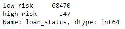
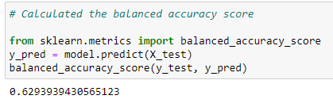
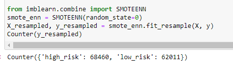

# Credit_Risk_Analysis

### Overview 
  -This week my boss Jill is giving me a task to investigate and assess a csv file involving loan and credit risks being low or high and finding certain details in the data. I started by learning logistic regression being a classification model to infer if a credit card holder is going to miss a credit card payment this month or make a payment on time. For me to be making predications as I just mentioned a very useful tool I will be using is called positive predicted value(PPV) this will help me in solidifying my findings. 
  
### Results
  -The outcome of our analysis was very staight forward if not a bit suprising. I found that the amount of low risk and high risk loans were very far apart as shown below. I thought that I would find a much closer gap between high and low risk loans. 
  
   
  
  -Secondly I was able to balance the random forest classifier and then balance the accuracy score from that. Below I also have a photo of one balance score.
  
  
  
### Summary
  -In conlusion I feel like we got very precise and accurate results in our analysis of loan / credit risks. Going back to some results I found surprising was the vast difference in high and low risk loans. I found it very interesting just how many low risk options we have compared to high risk. 
  -Also noticing that the training data we used to resample with SMOTEEN was much more balanced in the sense of high and low risk loans.
  
  
  
  -Lastly I believe either model I used this week to balance data or to plot different arrays were both very similar and very descriptive with similar outcomes. Personally I felt using the balanced accuracy score was easier for me and very close in results. 
